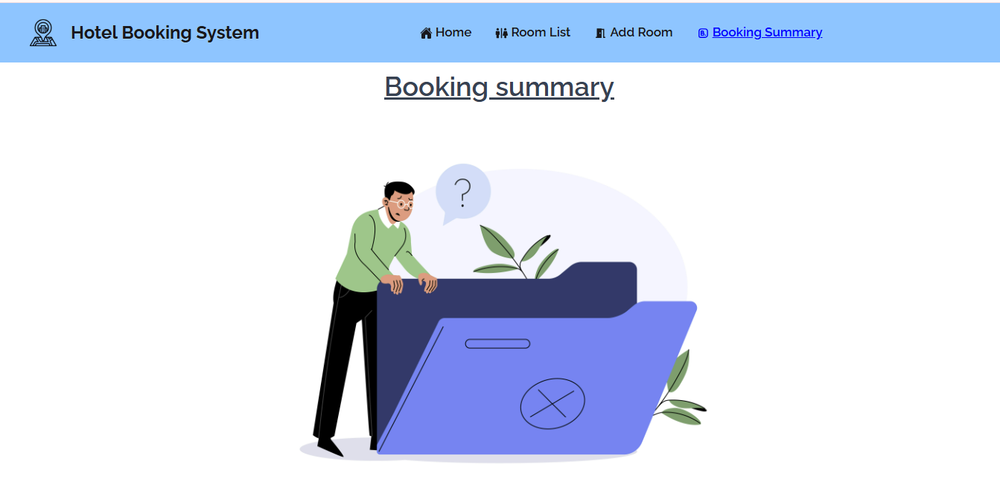

# 🌐 Hotel Booking Frontend

Frontend of the **Minimal Hotel Room Booking Management System**.  
Users can browse rooms, check availability, and book rooms with a simple, responsive UI.

---

## 🚀 Tech Stack

- **HTML5**
- **Tailwind CSS**
- **React JS**
- **DaisyUI**
- **Framer Motion**
- **Sweet alert2**

---

📌 Features :

✅ View all rooms

✅ Book available rooms (with form validation)

✅ Edit/Delete rooms (admin)

✅ Sweet alert for success/error

✅ Create room

✅ Booking summary report page

## ⚙️ Setup Instructions

### 1. Clone Repository

```bash
git clone https://github.com/Pritom07/Hotel-Booking-client.git
cd Hotel-Booking-client
```

## 🖼️ Screenshots

### 🏠 Home Page 1st Screenshot


### 🏠 Home Page 2nd Screenshot


### 🏠 Home Page 3rd Screenshot


### 🛏️ Room Card with Edit/Delete/Book button


### 🛏️ Room Card with Edit/Delete/Book button


### 🛏️ Edit Room


### 🛏️ Delete Room


### 📖 Booking Room


### 📖 Create Room


### 📊 Booking Summary



```

```
